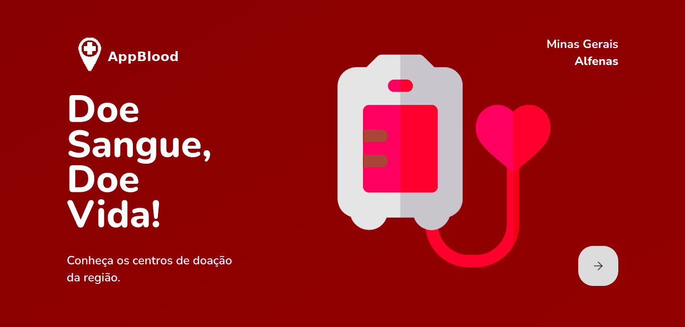

# AppBloodCenter
# Descrição do Projeto
<p align="center">
Aplicação em desenvolvimento para a disciplina TCC do curso de pós graduação de tecnologias para desenvolvimento Web - IFSULDEMINAS.
</p>

<h1 align="center">
  
</h1>

# Pré-requisitos

Antes de começar, você vai precisar ter instalado em sua máquina as seguintes ferramentas:
[Git](https://git-scm.com), [Node.js](https://nodejs.org/en/). 
Além disto é bom ter um editor para trabalhar com o código como [VSCode](https://code.visualstudio.com/)

# 🎲 Rodando o Front End

```bash
# Clone este repositório
$ git clone <https://github.com/rosana-moreira/AppBloodCenter.git/>

# Acesse a pasta do projeto no terminal/cmd
$ cd AppBloodCenter/web

# Instale as dependências
$ yarn

# Execute a aplicação em modo de desenvolvimento
$ yarn start

### 🎲 Rodando o Back End

# Acesse a pasta do projeto no terminal/cmd
cd AppBloodCenter/server

# Instale as dependências
$ yarn

# Execute a aplicação em modo de desenvolvimento
$ yarn dev

# O servidor do front-end inciará na porta:3000 - acesse <http://localhost:3000>
# O servidor do back-end inciará na porta:3333 - acesse <http://localhost:3333>

```
